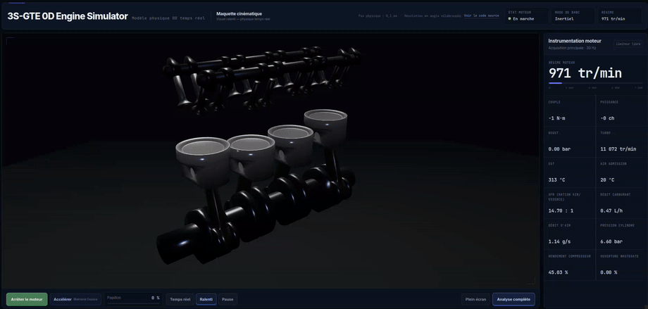
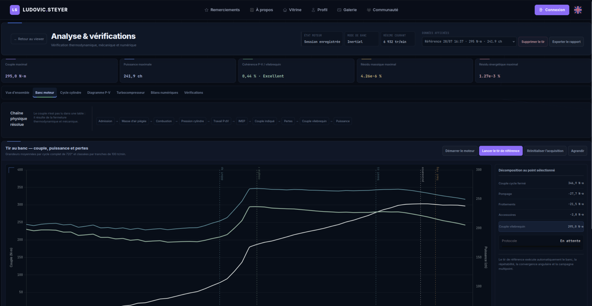

<div align="center">

# 3S-GTE 0D Engine Simulator

**Simulateur physique 0D temps réel d’un moteur Toyota 3S-GTE ST205, résolu en angle vilebrequin.**

Projet personnel conçu, intégré et vérifié par **Ludovic Steyer**.

**[ludovicsteyer.com](https://ludovicsteyer.com/enginesimulator)**
</div>


---

## Aperçu






---

## ⚠️ Périmètre de ce dépôt

Ce dépôt contient principalement le noyau de simulation numérique, les outils de vérification et la documentation technique du projet.

La version interactive du simulateur est intégrée dans mon application web personnelle développée avec Symfony/Twig. Cette application complète n’est pas incluse dans ce dépôt.

En conséquence, ce repository n’est pas conçu pour être exécuté directement comme une application web autonome.

Certains fichiers, notamment `main.js` et `analysis.js`, dépendent d’éléments d’interface présents uniquement dans l’application Symfony, par exemple :

- boutons de contrôle du moteur ;
- éléments d’instrumentation ;
- canvas Three.js ;
- panneaux d’analyse ;
- graphiques ;
- sélecteurs et contrôles de l’interface.

Ces éléments HTML/Twig ainsi que l’intégration Symfony correspondante ne sont volontairement pas publiés ici.

En revanche, les modules physiques et numériques ainsi que la suite de vérification peuvent être examinés indépendamment. Les tests automatisés inclus dans ce dépôt permettent notamment de vérifier la géométrie, les sous-modules physiques, les scénarios transitoires et plusieurs propriétés numériques du simulateur.

La démo interactive complète est disponible sur mon portfolio :

**[ludovicsteyer.com](https://ludovicsteyer.com/enginesimulator)**

Ce dépôt a donc principalement pour objectif de rendre accessibles :

- la logique physique du simulateur ;
- les méthodes numériques utilisées ;
- l’architecture des différents sous-systèmes ;
- les tests et protocoles de vérification ;
- la provenance et la classification des paramètres ;
- la documentation technique du modèle.

---

## TypeScript, compilation et intégration Symfony

Le noyau de simulation est écrit en TypeScript. Les navigateurs et Symfony AssetMapper n’exécutent pas directement ces fichiers `.ts` : une compilation est donc nécessaire avant déploiement.

Installation et vérification :

```bash
npm ci
npm run typecheck
npm test
```

Compilation seule :

```bash
npm run build
```

Les artefacts JavaScript destinés au navigateur sont générés dans :

```text
.build/assets/
```

Le dossier `.build/` est volontairement exclu de Git : le dépôt versionne les sources, pas les artefacts générés.

---

## Objectif

Le projet ne lit pas le couple dans une table `régime → couple`.

Il reconstruit une chaîne physique complète :

```text
débits gazeux
→ remplissage des cylindres
→ combustion
→ pression cylindre
→ travail P·dV
→ IMEP
→ couple indiqué
→ pompage et pertes mécaniques
→ couple au vilebrequin
→ puissance moteur
```

L’objectif est de réunir dans une application web temps réel :

- thermodynamique 0D ;
- mécanique bielle-manivelle ;
- écoulements compressibles ;
- combustion simplifiée ;
- dynamique du turbocompresseur ;
- banc moteur ;
- vérification numérique ;
- visualisation Three.js ;
- analyse Chart.js.

Le projet est un **outil d’apprentissage, de démonstration et de vérification interne**. Il ne remplace pas un logiciel industriel, une campagne d’essais ou un modèle constructeur.

---

## Résultats de référence

Le dépôt inclut un **tir déterministe** : l’état initial, le préconditionnement, la commande d’accélérateur, le banc et les acquisitions sont reproduits de manière identique à chaque exécution.

### Baseline actuelle

| Grandeur | Résultat |
|---|---:|
| Couple maximal | environ **295 N·m** |
| Régime du couple maximal | environ **4 100 tr/min** |
| Puissance maximale | environ **242 ch** |
| Régime de puissance maximale | environ **6 300 tr/min** |
| Boost maximal | environ **0,83 bar relatif** |
| Résolutions de convergence | **1,00° / 0,50° / 0,25° CA** |
| Vérification déterministe | **campagne complète exécutée automatiquement** |
| Cohérence P-V / couple indiqué | environ **0,6 %** au point de référence |
| Répétabilité du point de référence | environ **0,01 %** |
| Convergence angulaire maximale | environ **0,34 %** |

> Ces valeurs correspondent à la configuration de référence actuelle.  
> La baseline est enregistrée explicitement et utilisée pour les comparaisons de non-régression.

---

## Ce que le simulateur modélise

- quatre cylindres suivis individuellement sur 720° ;
- géométrie bielle-manivelle exacte ;
- collecteur d’admission 0D dynamique ;
- volume de suralimentation et intercooler ;
- échappement twin-entry à deux scrolls ;
- soupapes à levée variable ;
- débits compressibles bidirectionnels ;
- combustion par loi de Wiebe ;
- énergie interne et pression cylindre ;
- transfert thermique cylindre-paroi ;
- turbocompresseur avec inertie d’arbre ;
- wastegate et dérivation compresseur ;
- pompage, frottements et accessoires séparés ;
- démarreur, ralenti, rupteur et coupure en décélération ;
- banc inertiel, freiné ou régulé en régime ;
- enregistrement de cycles complets ;
- diagrammes `P(θ)` et `P-V` ;
- diagnostics de conservation de masse et d’énergie ;
- répétabilité multi-cycle ;
- convergence angulaire automatique.

---

## Géométrie de référence

| Paramètre | Valeur utilisée |
|---|---:|
| Architecture | 4 cylindres en ligne |
| Cylindrée calculée | environ 1 998 cm³ |
| Alésage | 86 mm |
| Course | 86 mm |
| Longueur de bielle | 138 mm |
| Rapport volumétrique | 8,5:1 |
| Cylindrée unitaire | environ 499,6 cm³ |
| Ordre d’allumage | 1-3-4-2 |
| Distribution | 16 soupapes |

Les paramètres non publiés par Toyota sont identifiés comme **estimés** ou **calibrés** dans la documentation technique.

---

## Vérification du modèle

La page **Analyse & Validation** exécute automatiquement des contrôles sur :

- couverture angulaire 0–720° ;
- résolution et continuité des échantillons ;
- absence de `NaN` et d’infinis ;
- cohérence angle-volume ;
- PMH, PMB et cylindrée reconstruite ;
- ordre allumage / CA10 / CA50 / CA90 ;
- position du pic de pression ;
- événements et levées de soupapes ;
- fermeture du couple indiqué ;
- fermeture IMEP ;
- sens du travail thermodynamique ;
- travail intégré sur le diagramme P-V ;
- cohérence P-V / couple au vilebrequin ;
- stabilité du point de fonctionnement ;
- répétabilité sur plusieurs cycles ;
- convergence à plusieurs pas angulaires ;
- conservation de la masse ;
- conservation de l’énergie.

Un contrôle non exécuté n’est jamais affiché comme validé.

La vérification interne répond à :

> Les équations implémentées et les bilans internes sont-ils cohérents entre eux ?

La validation externe répond à :

> Le modèle représente-t-il suffisamment bien le moteur réel ?

Cette seconde partie reste limitée par l’absence de données constructeur et de mesures instrumentées complètes.

---

## Diagramme P-V

Le travail indiqué est calculé directement par :

```text
W = ∮ P dV
```

Puis :

```text
IMEP = W / cylindrée unitaire
```

Pour un moteur quatre temps à quatre cylindres :

```text
couple indiqué = travail par cylindre × 4 / 4π
```

Le couple obtenu depuis le diagramme P-V est comparé au couple issu directement des efforts sur le vilebrequin.

Cette double voie de calcul permet de détecter :

- erreurs de signe ;
- incohérences de géométrie ;
- erreurs d’intégration ;
- différences entre moyenne temporelle et moyenne angulaire ;
- problèmes de rééchantillonnage du cycle.

---

## Turbocompresseur

Le turbo n’est pas activé par un seuil artificiel en régime.

Sa dynamique suit :

```text
J · dω/dt =
couple turbine
− couple compresseur
− pertes d’arbre
```

Le modèle représente notamment :

- deux alimentations turbine séparées ;
- puissance disponible dans les gaz ;
- rendement turbine analytique ;
- puissance mécanique turbine ;
- puissance absorbée compresseur ;
- rendement compresseur ;
- inertie de l’ensemble tournant ;
- pertes de palier et de brassage ;
- wastegate ;
- bypass compresseur ;
- intercooler ;
- volume de charge.

Il n’utilise pas de carte constructeur CT20B mesurée et ne prétend pas reproduire exactement une roue réelle sur toute sa plage.

---


## Campagnes automatiques

Au-delà du tir de référence, le modèle est vérifié sur plusieurs conditions de fonctionnement sans intervention manuelle.

### Campagne multipoint

Des points stabilisés couvrent notamment :

- ralenti ;
- charge légère ;
- charge intermédiaire ;
- pleine charge autour de la zone de spool ;
- point pleine charge de référence ;
- zone de puissance ;
- haut régime.

Pour chaque point, le banc régulé attend la stabilisation puis plusieurs cycles complets sont capturés.

Les contrôles portent notamment sur :

- régime moyen ;
- boost ;
- travail P-V ;
- IMEP ;
- pression maximale ;
- CA50 ;
- répétabilité multicyle ;
- dérive du boost ;
- dérive du régime turbo ;
- résidus de masse et d’énergie ;
- fermeture P-V / couple indiqué.

Les faibles signaux sont traités séparément : par exemple, au ralenti, un écart relatif peut sembler important alors que l’erreur absolue en couple reste très faible.

### Campagne transitoire

Des scénarios dynamiques déterministes testent également :

- montée en charge et spool à régime fixé ;
- ouverture et régulation de la wastegate ;
- lever de pied sous boost ;
- ouverture du bypass ;
- coupure d’injection ;
- frein moteur ;
- décélération du turbo ;
- reprise de charge ;
- intervention du rupteur et hystérésis de reprise.

Les métriques incluent les temps de réponse, les surpressions, les régimes turbo maximaux, les débits de dérivation et les résidus numériques pendant les transitions.

---

## Référence versionnée et non-régression

Une campagne déterministe complète peut être enregistrée comme **référence comportementale**.

Les campagnes suivantes sont comparées indicateur par indicateur sur les performances, le cycle thermodynamique, la répétabilité, la convergence, les résidus, les points multipoints et les réponses transitoires.

Chaque différence est classée selon une tolérance adaptée à la grandeur :

```text
Conforme
Variation
Régression
Non comparé
```

La référence n’est jamais remplacée automatiquement par une nouvelle exécution.

Cette approche permet de modifier un sous-modèle sans accepter silencieusement une dégradation ailleurs dans la simulation.

---

## Interface

### Viewer principal

- animation Three.js du mécanisme ;
- commandes moteur ;
- instrumentation compacte ;
- ralenti visuel indépendant de la physique ;
- accès à l’analyse complète.

### Analyse & Validation

- courbe couple / puissance ;
- décomposition du couple ;
- cycle cylindre sur 720° ;
- CA10, CA50, CA90 ;
- diagramme P-V ;
- bilan énergétique du turbo ;
- résidus masse / énergie ;
- rapport automatique de vérification ;
- sessions de référence ;
- exports CSV et rapport.

Les graphiques affichent des données calculées ou acquises. Ils ne sont pas décoratifs.

---

## Technologies

- TypeScript 7 en mode strict pour le noyau de simulation ;
- JavaScript ES modules pour les points d’entrée navigateur (`main.js`, `analysis.js`) ;
- Three.js ;
- Chart.js ;
- WebGL ;
- Node.js 20+ pour le typecheck, la compilation et la suite de vérification ;
- GitHub Actions pour l’intégration continue.

---

## Organisation

```text
assets/
├── main.js                 # point d’entrée navigateur du viewer
├── analysis.js             # point d’entrée navigateur de l’analyse
├── simulator/
│   ├── engine/             # état moteur et orchestration
│   ├── Geometry/
│   ├── Numerics/
│   ├── Physics/
│   ├── Intake/
│   ├── Exhaust/
│   ├── Valvetrain/
│   ├── Thermodynamics/
│   ├── Crankshaft/
│   ├── Turbo/
│   ├── Fuel/
│   ├── EngineControl/
│   ├── Dyno/
│   ├── Telemetry/
│   ├── Cycle/
│   ├── Diagnostics/
│   ├── Analysis/
│   └── Three/
└── types/                  # déclarations TypeScript locales

tests/
├── check-imports.mjs
├── check-syntax.mjs
├── run-all.mjs
├── submodules.test.mjs
└── transients.test.mjs

docs/
├── external-comparison.md
├── technical-overview.md
├── PARAMETERS.csv
└── PARAMETERS.json
```

---

## Limites principales

Le modèle ne résout pas :

- les ondes de pression 1D ;
- les champs 3D ;
- la chimie détaillée ;
- le cliquetis ;
- les émissions ;
- les films de carburant ;
- les variations cycle à cycle réelles ;
- le circuit de refroidissement complet ;
- la déformation et les contraintes mécaniques ;
- une carte turbo constructeur exacte ;
- une ECU Toyota complète.

Une calibration satisfaisante ne prouve pas qu’un jeu de paramètres est unique.

---

## Feuille de route

- documenter davantage les sources constructeur ;
- comparer à davantage de mesures externes ;
- compléter le versionnement des jeux de référence ;
- compléter les études de sensibilité ;
- déplacer la physique dans un Web Worker ;
- réduire progressivement les frontières encore typées dynamiquement dans les outils d’analyse ;
- renforcer les benchmarks analytiques et les tests numériques ;
- améliorer le viewer mécanique et les flux.

---

## Développement technique assisté par IA

Le développement a été fortement assisté par ChatGPT comme **outil d’accélération de l’implémentation, d’exploration et de revue technique**.

L’assistance a notamment servi à :

- proposer des structures de modules ;
- traduire des équations en code ;
- générer et reformuler des implémentations ;
- construire des interfaces de diagnostic ;
- accélérer la refactorisation et la documentation ;
- proposer des stratégies de test.

La valeur du projet ne repose toutefois pas sur la quantité de code produite, mais sur la capacité à **définir, intégrer, instrumenter et qualifier** le modèle.

Le travail de conception et de validation a porté sur :

- la définition des objectifs et hypothèses ;
- l’architecture des sous-modèles ;
- l’analyse des unités et conventions de signe ;
- la détection des comportements non physiques ;
- la conception des campagnes déterministes ;
- les fermetures P-V / vilebrequin ;
- la conservation de masse et d’énergie ;
- la répétabilité et la convergence ;
- les scénarios transitoires ;
- la non-régression versionnée ;
- la décision de conserver ou rejeter une modification ;
- la documentation des limites et incertitudes.

Les sorties générées sont donc traitées comme des **propositions à vérifier**, pas comme une source de vérité.

L’objectif est de montrer qu’un développement fortement assisté par IA peut rester **compréhensible, reproductible, instrumenté et contrôlé par une démarche d’ingénierie**.

Voir [`docs/technical-overview.md`](docs/technical-overview.md#25-développement-technique-assisté-par-ia).

---

## Avertissement

Les résultats sont fournis à des fins pédagogiques et de portfolio.

Ils ne doivent pas servir à :

- régler un moteur réel ;
- modifier une injection ou un allumage ;
- dimensionner un composant ;
- prendre une décision de sécurité ;
- annoncer des performances certifiées.

---


## License

Copyright © 2026 Ludovic Steyer. All rights reserved.

The source code is publicly available for portfolio review and
educational inspection. No license is granted for redistribution,
modification, commercial use, or incorporation into other projects.

For permission to reuse any part of this project, please contact the author.